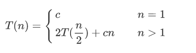
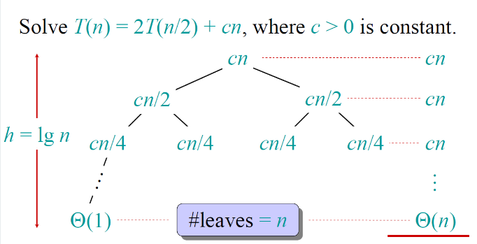

最近面试的时候，感觉对于排序的问题被问到的比较多，所以想对排序的几种算法做一个总结，顺便帮助自己巩固基础，在这里借助[算法导论](https://github.com/JellyP/JellyP.github.io/blob/master/reference/%E7%AE%97%E6%B3%95%E5%AF%BC%E8%AE%BA%E4%B8%AD%E6%96%87%E7%89%88.pdf)这本书，在介绍以下几种排序算法。


所谓排序问题就是满足这样的条件，例如：

输入为n个数的序列：$<a_1,a_2,\cdots,a_n>$。

输出为一个排好序的n个数的序列：$<{a_1}^{'},{a_2}^{'},\cdots,{a_n}^{'}>$，满足${a_1}^{'}\le{a_2}^{'}\le\cdots\le{a_n}^{'}$。


<h3>插入排序</h3>

插入排序可以理解成是打扑克牌的时候，在最后整个牌在你手上是一个从小到大排序的状态。一开始没有摸牌的时候，手上的牌是空的，每次摸起一张牌，就让其插入在正确的位置，为了让其插入正确的位置，就需要从左到右地去查找，这个过程就是类似插入排序了，而每次摸牌结束后，自己手上的牌都是排好序了的状态。


伪代码：

```C++
INSERTION-SORT(array a[])
{
  for j=2 to a.length
    key=a[j] //将a[j]临时保存，并将其插入到已经排序好的a[1,...,j-1]中，类似摸牌的过程，现在摸的是第j张牌。
    i=j-1
    while i>0 and a[i]>key //找到所有比他大的数字，让它放在其右边，实现从小到大排序
      a[i+1]=a[i];
  	  i=i-1
    a[i+1]=key//将a[j]即key的值放入正确的位置
}
```

在INSERTION-SORT中，若输入数组已排好序，则出现最佳情况。这时最佳的运行时间可以看成是$an+b$，其中$a$和$b$依赖于每个语句的代价，具体推导在这里不做赘述，可以看出其是线性函数，即$O(n)$。

而其最坏的情况，运行时间可以表示为$an^2+bn+c$，其中$a$、$b$和$c$依赖每个语句的代价。具体推导在这里不做赘述，可以看出其是n的二次函数，即$O(n^2)$。


<h3归并排序</h3>

归并排序的本质是分治法的一种应用，即为了解决一个给定的问题，算法一次或者多次递归地调用其自身以解决紧密相关的子问题。

分治法在每层递归有三个步骤，以归并排序为例：

- 分解：将原问题分解为若干个子问题，这些子问题是原问题的规模较小的实例。归并排序中则是将待排序的n个元素的序列分成各具$\frac{n}{2}$两个子序列。
- 解决：将子问题解决，利用递归的方式求解，当子问题规模足够小的时候，直接得出答案。归并排序中则是递归地排序两个子序列，当子序列足够小则直接得到答案。
- 合并：将子问题的解合并成原问题的解。归并排序中则将两个已经排序的子序列以产生已排序的答案。

归并排序的关键步骤在于“合并”两个已排序的子序列，通常我们可以借助一个辅助过程$\text{MERGE}(A,p,q,r)$来完成合并，其中$A$是一个数组，$p$,$q$和$r$是数组下标，满足$p\le q<r$。假设在该过程中，$A[p,\cdots,q]$和$A[q+1,\cdots,r]$都是已经排好序的子序列，这个函数能够合并当前两个子数组形成一个新的已经排好序的子数组并代替当前的子数组$A[p,\cdots,r]$，总的代价为O(n)。

其工作步骤我们还是回到扑克牌的例子，假设你的面前现在有两堆已经排好序的扑克牌，牌面朝上，最小的牌都在最上面，我们希望你拿到手上的时候，得到一堆完整的排好序的牌。那么要怎么做呢，我们的基本步骤就是每次将两堆牌上你看到的最小的牌拿上来，直到一边的牌全部拿完即可。在归并的过程中，待合并元素的总数是$n=r-p+1$，那么也就是一旦执行了$r-p+1$个步骤，算法就可以停止了，这里有一个问题，就是怎么知道有一个堆为空呢，可以通过在每个牌堆底部放置一个哨兵牌，表示一个特殊的值，在这里为了简化，可以使用$\infty$来表示，因为不可能出现比他还小的牌，所以当有一个堆显露出这个牌的时候，表示这个堆已经取完，当两个堆同时出现时，表示所有非哨兵牌已经被排序好了，我们的目标也就完成了。

伪代码为：

```C++
MERGE(A,p,q,r)
{
	n1=q-p+1 //表示第一个子序列的长度
	n2=r-q //表示第二个子序列的长度
	let L[1,...,n1+1] and R[1,...,n2+1] be new arrays //新建两个新数组用于储存两个排好序的序列
	for i=1 to n1 //L[i]存A[p,...,q]的序列
		L[i]=A[p+i-1]
	for j=1 to n2 //R[j]存A[q+1,...,r]的序列
		R[j]=A[q+j]
	L[n1+1]=inf //L和R最后一个数组置为无穷
	R[n2+1]=inf
	i=1,j=1
	for k=p to r //执行r-p+1次
		if L[i]<=R[j] //选择L和R中较小的值放入A中
			A[k]=L[i]
			i=i+1;
		else
			A[k]=R[j]
			j=j+1
}
```

而如果不使用哨兵牌的方式，也可以最后进行检查其是否为空，在这里介绍下另一种思路：

```c++
MERGE(A,p,q,r)
{
	n1=q-p+1 //表示第一个子序列的长度
	n2=r-q //表示第二个子序列的长度
	let L[1,...,n1] and R[1,...,n2] be new arrays //新建两个新数组用于储存两个排好序的序列
	for i=1 to n1 //L[i]存A[p,...,q]的序列
		L[i]=A[p+i-1]
	for j=1 to n2 //R[j]存A[q+1,...,r]的序列
		R[j]=A[q+j]
	i=1,j=1
	while i<=n1 && j<=n2 //一直取牌直到有一个牌堆为空的时候
		if L[i]<=R[j] //选择L和R中较小的值放入A中
			A[k++]=L[i++]
		else
          	 A[k++]=R[j++]
	while i<=n1 //当L牌堆还有空的时候
		A[k++]=L[i++]
	while j<=n2 //当R牌堆还有空的时候
		A[k++]=R[j++]
}
```

接下来就是通过将过程MERGE作为归并排序的子程序来用，书写归并排序。即$\text{MERGE-SORT}(A,p,r)$，其意义为通过这个函数能够排序子数组$A[p,\cdots,r]$中的元素，当$p\ge r$时，该子数组最多只有一个元素，所以是已经排好序的结果，对应分治法中的子问题规模足够小的情况。否则，将$A[p,\cdots,r]$分解成两个子数组$A[p,\cdots,q]$和$A[q+1,\cdots,r]$两个数组，前者包含$\lceil\frac{n}{2}\rceil$个元素，后者包含$\lfloor\frac{n}{2}\rfloor$个元素，伪代码为：

```c++
MERGE-SORT(A,p,r)
{
  if p<r
    q=(p+r)/2 //分解
    MERGE-SORT(A,p,q) //排序A[p,...,q]
    MERGE-SORT(A,q+1,r) //排序A[q+1,...,r]
    MERGE(A,p,q,r) //归并
}
```

为了给整个序列$A=<A[1],A[2],\cdots,A[n]>$，我们执行初始调用MERGE-SORT(A,1,A.length)。为了计算归并排序的时间复杂度，我们可以将$T(n)$表示成规模为$n$的问题的运行时间。

那么归并排序的最坏时间复杂度为：



其中c表示求解规模为1的问题所需要的时间以及在分解过程中与合并步骤处理每个元素所需要的时间。



如图所示，我们可以通过构建递归树的形式，得到一个具有$\text{lg}n+1$层的树，每层贡献总代价为$cn$，所以总代价为$cn\lg n+cn$，即复杂度为${O}(n\lg n)$。 


